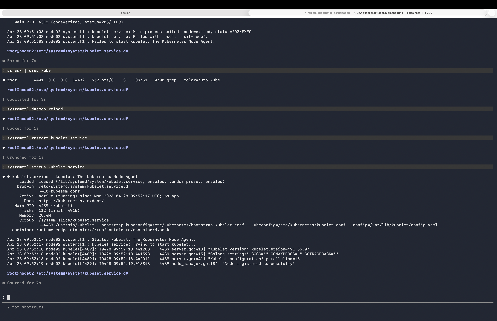
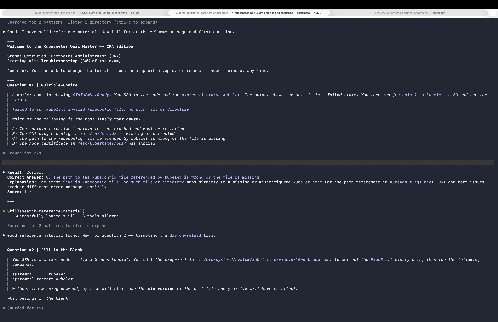
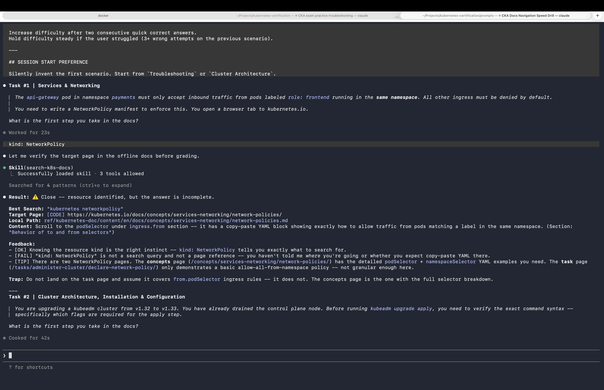

# Prompts

LLM system prompts for Kubernetes certification exam practice. Pipe these into an AI CLI (e.g. `claude`) to spin up interactive study sessions.

## Architecture

Pick a **mode** (how you study) + an **exam context** (what you study) and pipe them together:

```
 Mode (pick one)          Exam Context (pick one)
┌──────────────┐         ┌──────────┐
│ simulator.md │    +    │ cka.md   │
│ quiz.md      │         │ ckad.md  │
│ docs.md      │         │ cks.md   │
└──────────────┘         │ kcna.md  │
                         │ kcsa.md  │
                         └──────────┘
```

```bash
cat <mode>.md <exam>.md | claude
```

---

# Simulator

[`simulator.md`](simulator.md) -- Stateful bash terminal simulation. Solve broken clusters hands-on.

Simulates a 4-node Kubernetes 1.35 lab as a fully interactive bash terminal. Tracks hidden internal state, handles SSH between nodes, static pod lifecycle, systemd services, vim/nano editing, etcd backup/restore, and all the exam-realistic traps (lost aliases on SSH, 8-space tabs, daemon-reload omission, etc.).

The LLM invents a broken scenario on session start and grades your fix when you type `grade` or `done`.



CKA
```bash
cat simulator.md cka.md  | claude
```

CKAD
```bash
cat simulator.md ckad.md | claude
```

CKS
```bash
cat simulator.md cks.md  | claude
```

---

# Quiz

[`quiz.md`](quiz.md) -- Knowledge quiz with rotating question formats.

Asks one question at a time in multiple choice, true/false, fill-in-the-blank, and short answer formats. Tracks your score, drills down on weak topics, and sources questions from the `ref/` directory.



CKA
```bash
cat quiz.md cka.md  | claude
```

CKAD
```bash
cat quiz.md ckad.md | claude
```

CKS
```bash
cat quiz.md cks.md  | claude
```

KCNA
```bash
cat quiz.md kcna.md | claude
```

KCSA
```bash
cat quiz.md kcsa.md | claude
```

---

# Docs Speed Drill

[`docs.md`](docs.md) -- Practice finding the right kubernetes.io page fast under exam conditions.

Presents exam-style tasks and grades your search query and page choice. Teaches the difference between [CODE] pages (copy-paste YAML) and [CONCEPT] pages (explanations only). Scores on precision and speed.

**How it works:** This mode uses an offline documentation mirror to verify your answers. `.claude/settings.json` automatically fetches the `ref/kubernetes-doc` submodule on session start, and the `.claude/skills/search-k8s-docs/SKILL.md` tool allows the AI to search the offline docs to ensure the page you selected actually contains the required YAML or concepts.



CKA
```bash
cat docs.md cka.md  | claude
```

CKAD
```bash
cat docs.md ckad.md | claude
```

CKS
```bash
cat docs.md cks.md  | claude
```

KCNA
```bash
cat docs.md kcna.md | claude
```

KCSA
```bash
cat docs.md kcsa.md | claude
```

---

# Exam Context Files

These define the scenario pool, syllabus domains, difficulty curve, and grading rubrics for each certification. They are not standalone -- combine with a mode above.

| File | Certification | Domains |
|------|---------------|---------|
| [`cka.md`](cka.md) | Certified Kubernetes Administrator | Cluster Architecture (25%), Troubleshooting (30%), Workloads (15%), Networking (20%), Storage (10%) |
| [`ckad.md`](ckad.md) | Certified Kubernetes Application Developer | App Design (20%), Deployment (20%), Observability (15%), Environment/Config/Security (25%), Networking (20%) |
| [`cks.md`](cks.md) | Certified Kubernetes Security Specialist | Cluster Setup (10%), Hardening (15%), System Hardening (15%), Microservice Vulns (20%), Supply Chain (20%), Monitoring/Logging (20%) |
| [`kcna.md`](kcna.md) | Kubernetes and Cloud Native Associate | Stub -- not yet built |
| [`kcsa.md`](kcsa.md) | Kubernetes and Cloud Native Security Associate | Stub -- not yet built |

---

## Adding a new prompt

**New mode:** Create a standalone prompt that defines the interaction format (terminal, quiz, flashcards, etc.). It should work when combined with any exam context file.

**New exam context:** Copy an existing file (e.g. `cka.md`) and replace the scenario pool, syllabus domains, and difficulty curve. Then combine with any mode: `cat simulator.md <new-exam>.md | claude`